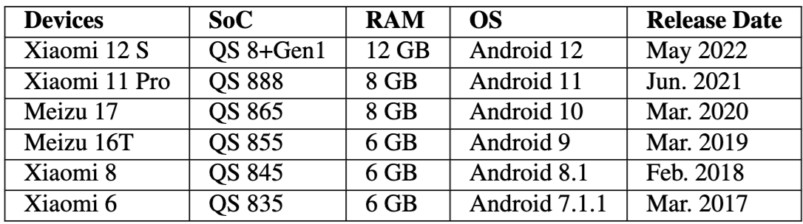

# SoC Evolution Benchmark

The SoC evolution benchmark targets the performance improvements of the top-tier Snapdragon SoCs released from 2017 to 2022.

The used Snapdragon SoC models:



This experiment focus on two workloads:

- Deep learning (DL) inference on the ResNet-50 model

- Live streaming transcoding on two videos: (1) V4: presentation; (2) V5: hall

## Setup

Software:

- DL inference: TFLite (the `benchmark_model` binary)

- Live streaming transcoding: FFmpeg with libx264 support (the `ffmpeg-x264` binary) and LiTr (MediaCodec)

## Exec

Commands to run DL inference on SoC CPU/GPU/DSP:

SoC CPU:

```
./benchmark_model --graph=resnet50.tflite --num_threads=4 --input_layer=input --input_layer_shape=1,224,224,3
```

SoC GPU:

```
./benchmark_model --graph=resnet50.tflite --input_layer=input --input_layer_shape=1,224,224,3 --use_gpu=true
```

SoC DSP:

```
./benchmark_model --graph=resnet50-quant.tflite --input_layer=input --input_layer_shape=1,224,224,3 --use_hexagon=true --hexagon_profiling=true
```

Commands to run video transcoding on SoC CPU and SoC hardware codec:

SoC CPU:

```
# V4: presentation
./ffmpeg -benchmark -i presentation_1920x1080_25.mkv -c:v libx264 -b:v 215000.0 -maxrate 215000.0 -bufsize 215000.0 -preset superfast -tune zerolatency -f null -

# V5: hall
./ffmpeg -benchmark -i hall_1920x1080_29.mkv -c:v libx264 -b:v 4147200 -maxrate 4147200 -bufsize 4147200 -preset superfast -tune zerolatency -f null -
```

SoC hardware codec:

1. Install the LiTr app (`litr-sdkver-25.apk` for older Android devices and `litr-sdkver-29.apk` for newer Android devices)

2. Prepare longer videos for high-end hardware codec: repeating the video 10 times to make it longer
```
ffmpeg -stream_loop 9 -i hall.mp4 -c copy hall_10.mp4
ffmpeg -stream_loop 9 -i pre.mp4 -c copy pre_10.mp4
```

3. Push videos (we used mp4 videos here due to the incompatibility issues by putting mkv videos to LiTr) to internal storage.
Videos can be found at Google Drive: `transcoding/videos-mp4/`
```
adb shell mkdir -p /storage/emulated/0/videos-mp4/
adb push hall.mp4 pre.mp4 /storage/emulated/0/videos-mp4/
adb push hall_10.mp4 pre_10.mp4 /storage/emulated/0/videos-mp4/
```
4. Transcode video using LiTr.

Settings:

Video | Width | Height | Bitrate | Key Frame Interval
--- | --- | --- | --- | ---
hall_10.mp4 | 1920 | 1080 | 4.1472 | 5
pre_10.mp4 | 1920 | 1080 | 0.215 | 5
