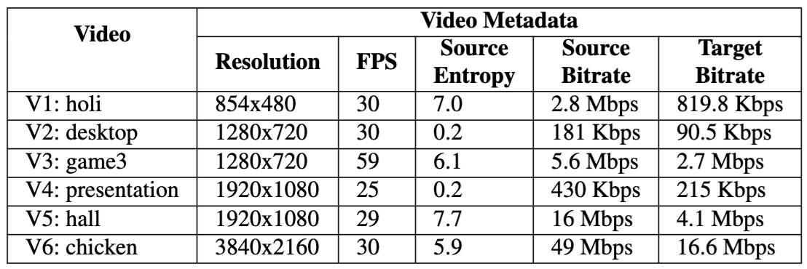

# Video Bitrate In Live Streaming Transcoding

This benchmark aims to inspect output videos' bitrates in live streaming transcoding using SoC-CPU (libx264) and SoC hardware codec.

## Setup

Hardware: SoC-Cluster

Software ([Checkout for Download link](../README.md#resources)):

1. SoC Hardware Codec: An Android application: LiTr

2. SoC-CPU: The ffmpeg binary with libx264 support


## Step-by-step Guide

### SoC Hardware Codec

1. As the used version of LiTr only correctly interprets mp4 video files, we need to first convert all videos to mp4 format using commands like the following:

```
ffmpeg -i videos/[video].mkv videos/[video].mp4
```

2. Push all videos to SoC

```
adb push videos/*.mp4 /storage/emulated/0/videos/
```

3. Install LiTr app (`litr-sdkver-25.apk` for older Android devices and `litr-sdkver-29.apk` for newer Android devices)

4. Use the following transcoding configurations for each video



5. Pull the video transcoding results and print their bitrates using `ffprobe`; transcoded videos are located in `/storage/emulated/0/Movies/LiTr/transcoded_*.mp4`

```
ffprobe -i [video]
```

### SoC CPU

1. Push all videos to SoC

```
adb push videos/ videos/ /storage/emulated/0/
```

2. Use the following transcoding commands to transcode each video

```
adb shell mkdir -p /storage/emulated/0/videos/soccpu_bitrate/
```

Video | Command
---      | ---
holi | `ffmpeg -i /storage/emulated/0/videos/holi_854x480_30.mkv -c:v libx264 -threads 1 -b:v 819840 -maxrate 819840 -bufsize 819840 -preset veryfast -tune zerolatency -y /storage/emulated/0/videos/soccpu_bitrate/holi_854x480_30.mkv`
desktop | `ffmpeg -i /storage/emulated/0/videos/desktop_1280x720_30.mkv -c:v libx264 -threads 1 -b:v 90500.0 -maxrate 90500.0 -bufsize 90500.0 -preset veryfast -tune zerolatency -y /storage/emulated/0/videos/soccpu_bitrate/desktop_1280x720_30.mkv`
game3 | `ffmpeg -i /storage/emulated/0/videos/game3_1280x720_59.mkv -c:v libx264 -threads 1 -b:v 2764800 -maxrate 2764800 -bufsize 2764800 -preset veryfast -tune zerolatency -y /storage/emulated/0/videos/soccpu_bitrate/game3_1280x720_59.mkv`
presentation | `ffmpeg -i /storage/emulated/0/videos/presentation_1920x1080_25.mkv -c:v libx264 -threads 1 -b:v 215000.0 -maxrate 215000.0 -bufsize 215000.0 -preset superfast -tune zerolatency -y /storage/emulated/0/videos/soccpu_bitrate/presentation_1920x1080_25.mkv`
hall | `ffmpeg -i /storage/emulated/0/videos/hall_1920x1080_29.mkv -c:v libx264 -threads 1 -b:v 4147200 -maxrate 4147200 -bufsize 4147200 -preset superfast -tune zerolatency -y /storage/emulated/0/videos/soccpu_bitrate/hall_1920x1080_29.mkv`
chicken | `ffmpeg -i /storage/emulated/0/videos/chicken_3840x2160_30.mkv -c:v libx264 -threads 8 -b:v 16588800 -maxrate 16588800 -bufsize 16588800 -preset ultrafast -tune zerolatency -y /storage/emulated/0/videos/soccpu_bitrate/chicken_3840x2160_30.mkv`

2. Pull the video transcoding results and print their bitrates using `ffprobe`

```
adb pull /storage/emulated/0/videos/soccpu_bitrate/ .
ffprobe -i [video]
```


